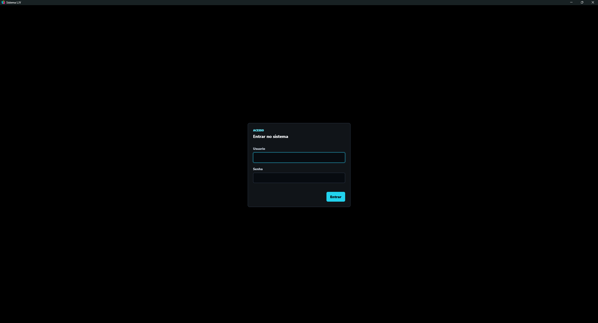
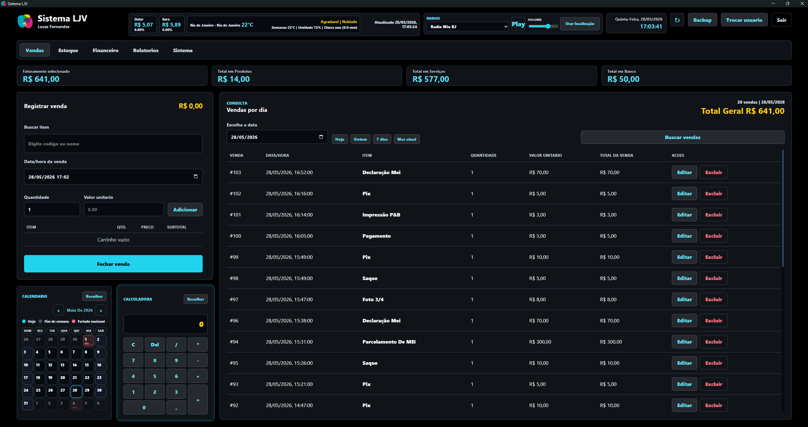
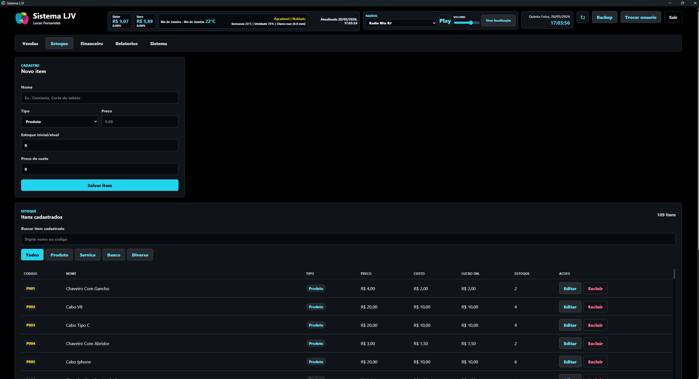
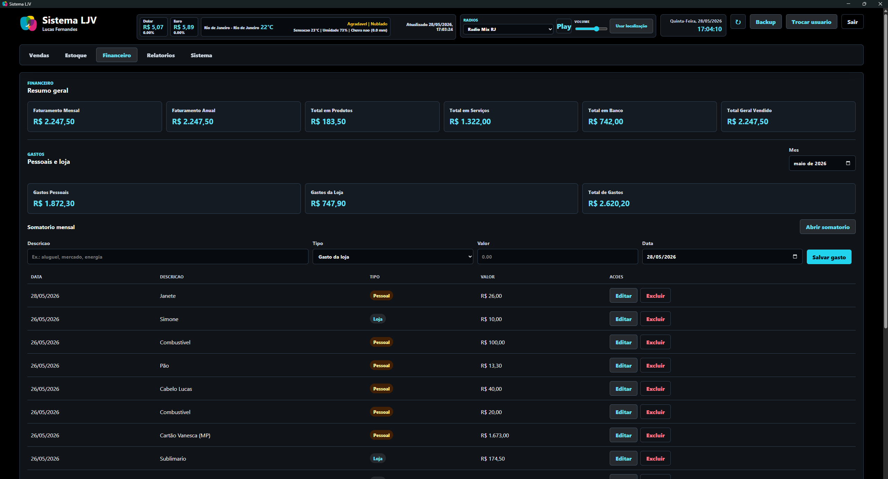
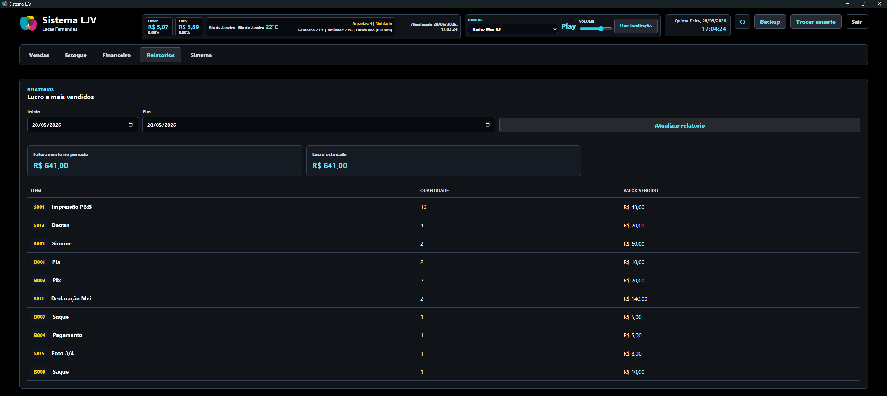
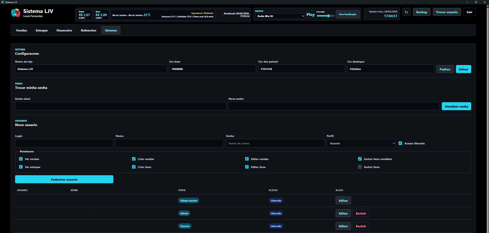

# Sistema LJV

Sistema web serverless para gestao comercial, desenvolvido para centralizar vendas, estoque, financeiro, relatorios, usuarios, permissoes, auditoria e backup em uma unica aplicacao.

Este repositorio e um **case study tecnico e visual** do projeto. O codigo-fonte principal permanece privado para proteger regras de negocio, estrutura operacional e propriedade intelectual do sistema.

## Visao Geral

O Sistema LJV foi desenvolvido como uma aplicacao web completa, com frontend em TypeScript e backend serverless em Cloudflare Workers. A persistencia utiliza Cloudflare D1, banco SQLite serverless, com schema versionado por migrations.

O projeto foi pensado para operacao real de loja: registrar vendas, controlar produtos, acompanhar financeiro, consultar relatorios, gerenciar usuarios e manter rastreabilidade das acoes sensiveis.

## Stack Tecnica

- TypeScript
- Cloudflare Workers
- Cloudflare D1
- Hono
- Zod
- SQLite
- Wrangler
- Esbuild
- HTML e CSS

## Principais Funcionalidades

- Login com sessao segura.
- PDV para registro e consulta de vendas.
- Cadastro de produtos, servicos, bancos e itens diversos.
- Controle de estoque para produtos.
- Relatorios de vendas, faturamento e itens mais vendidos.
- Financeiro com gastos pessoais e gastos da loja.
- Gestao de usuarios e permissoes por modulo.
- Auditoria de acoes importantes.
- Backup e restore em SQL.
- Configuracoes visuais do sistema.
- Ferramentas de apoio como radio online, calendario, clima e cotacoes.

## Screenshots

### Login

### Vendas

### Estoque

### Financeiro

### Relatorios

### Configuracoes do Sistema

## Estrutura do Projeto

Uma versao organizada da estrutura tecnica esta disponivel em:

- [docs/estrutura-do-projeto.md](docs/estrutura-do-projeto.md)
- [assets/estrutura-projeto.txt](assets/estrutura-projeto.txt)

## Documentacao

- [Arquitetura](docs/arquitetura.md)
- [Funcionalidades](docs/funcionalidades.md)
- [Seguranca e operacao](docs/seguranca-e-operacao.md)
- [Como o sistema funciona](docs/como-funciona-o-sistema.txt)
- [Resumo profissional](docs/resumo-profissional.txt)

## Decisoes Tecnicas

O sistema concentra frontend e backend no mesmo projeto para simplificar deploy e operacao. O Worker entrega os assets estaticos e tambem expoe os endpoints de API. O D1 armazena os dados operacionais e as migrations mantem a evolucao do banco versionada.

As areas sensiveis do sistema contam com validacao, autenticacao, autorizacao por permissoes, auditoria, protecao de sessao e scripts de verificacao.

## Observacao Sobre o Codigo-Fonte

Este repositorio nao contem o codigo-fonte completo do produto. Ele foi preparado como case study tecnico no GitHub, com imagens, documentacao, descricao tecnica e estrutura do sistema.

O objetivo e demonstrar arquitetura, escopo, decisoes tecnicas e maturidade de construcao sem disponibilizar uma copia operacional do sistema.
