# ✨ Sistema LJV

> Sistema web serverless para gestão comercial, reunindo vendas, estoque, financeiro, relatórios, usuários, permissões, auditoria e backup em uma única aplicação.

Este repositório é o **case study técnico e visual** do Sistema LJV. O código-fonte operacional permanece privado para preservar regras de negócio, dados operacionais e propriedade intelectual.

## 🎯 Visão geral

O Sistema LJV foi desenvolvido para apoiar a rotina de uma loja, centralizando processos comerciais e administrativos em uma interface única, organizada e responsiva.

O produto utiliza TypeScript no frontend e uma arquitetura serverless baseada em Cloudflare Workers e Cloudflare D1. A estrutura de dados é versionada para permitir evolução com rastreabilidade.

## 🛠️ Tecnologias

- TypeScript
- Cloudflare Workers
- Cloudflare D1
- Hono
- Zod
- SQLite
- Wrangler
- Esbuild
- HTML e CSS

## 🚀 Funcionalidades

- 🔐 Login com sessão segura e controle de acesso.
- 🛒 PDV para registrar, editar e consultar vendas.
- 📦 Cadastro de produtos, serviços, bancos e itens diversos.
- 📋 Controle de estoque, ajustes e histórico de movimentações.
- 💰 Gestão financeira com receitas, gastos pessoais e gastos da loja.
- 📊 Relatórios de faturamento, lucro, itens mais vendidos e comparativo anual.
- 👥 Usuários, perfis e permissões por módulo.
- 🧾 Auditoria de ações importantes.
- 💾 Backup e restauração de dados.
- 🎨 Personalização visual da loja.
- 📻 Recursos de apoio, como rádio, calendário, clima e cotações.

## 🖼️ Interface atual

### 🔐 Login

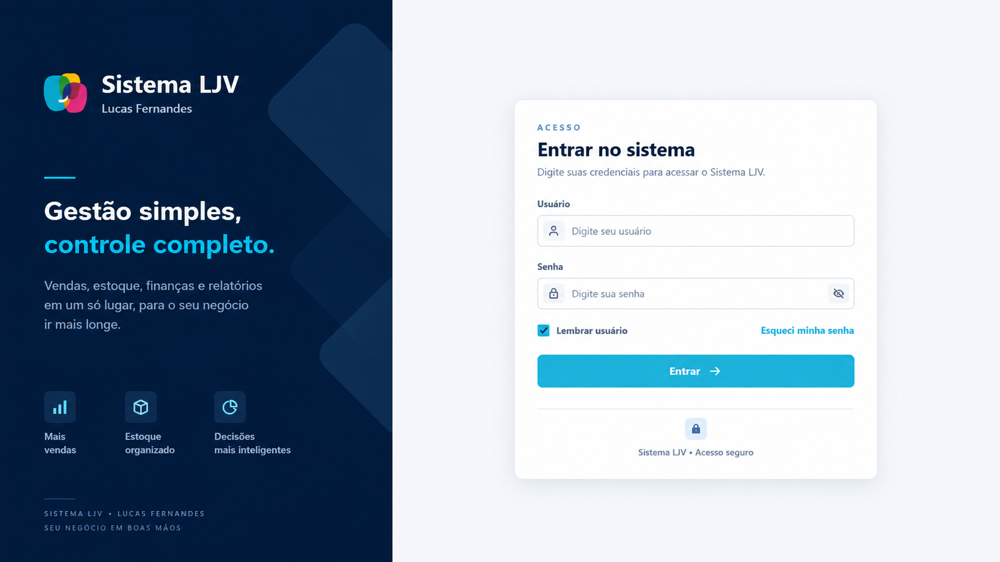

### 🛒 Vendas

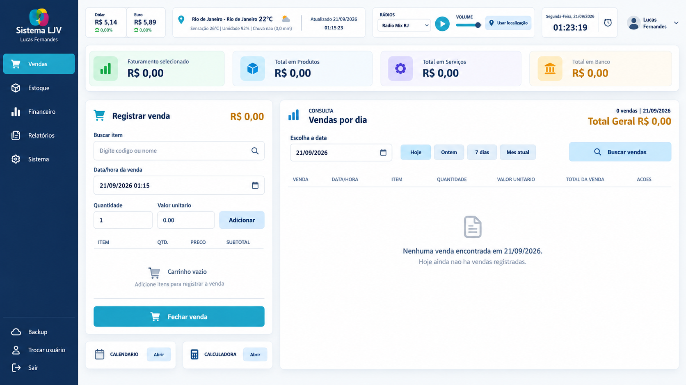

### 📦 Estoque

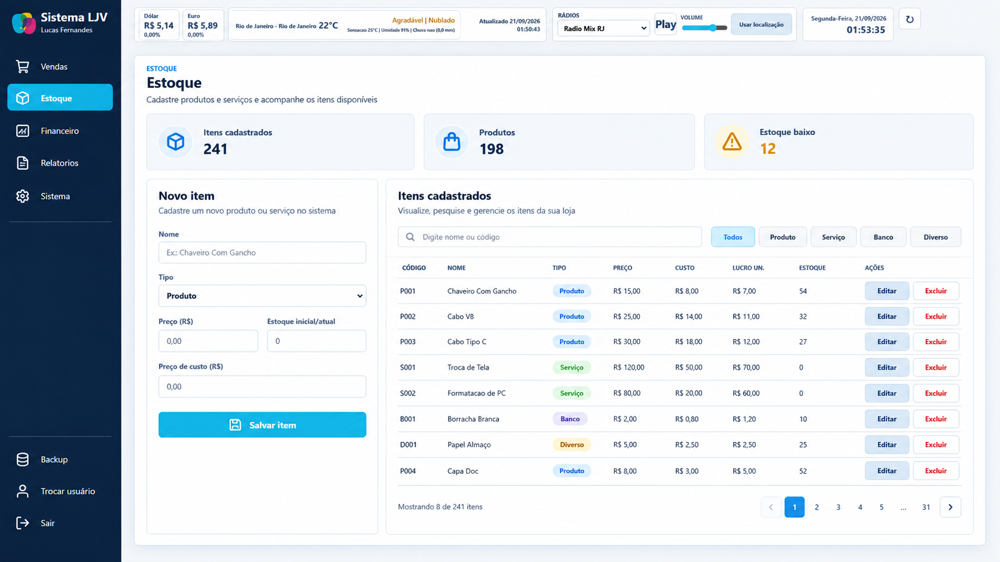

### 🧾 Histórico de estoque

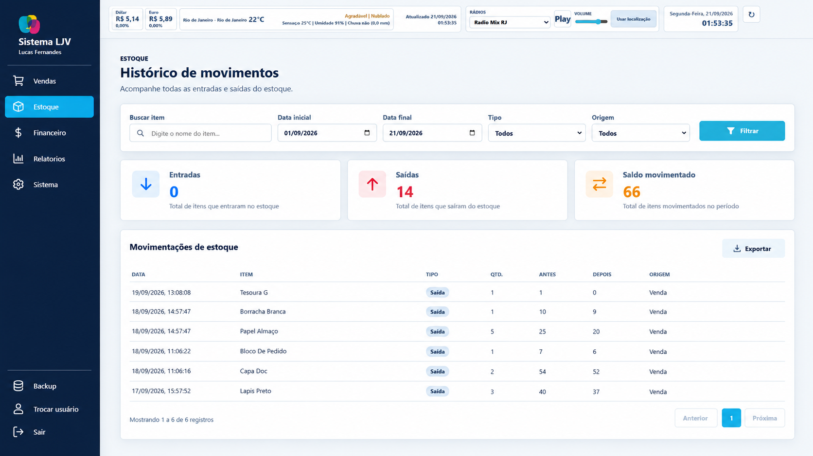

### 💰 Financeiro

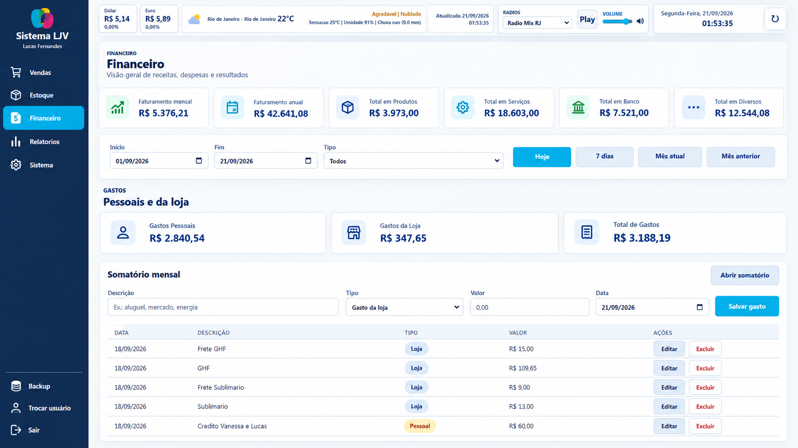

### 📊 Relatórios

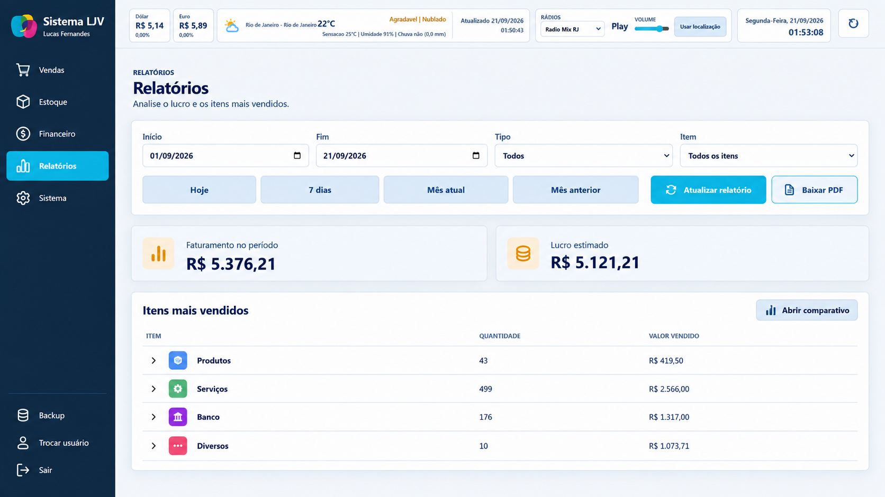

### 📈 Comparativo financeiro anual

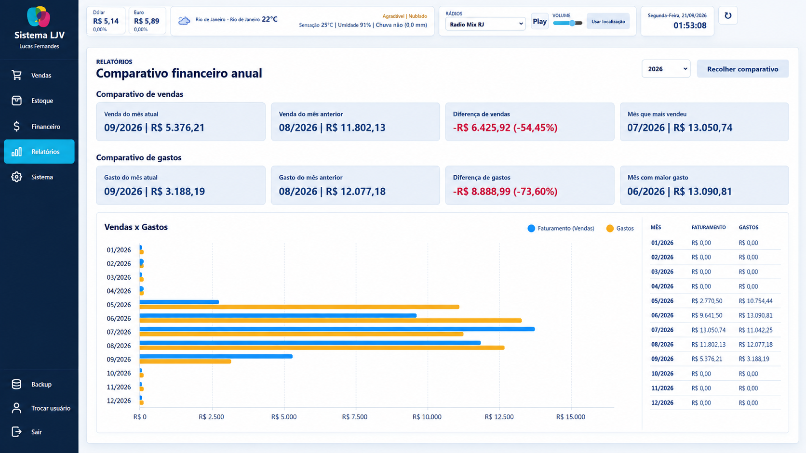

### ⚙️ Configurações, usuários e permissões

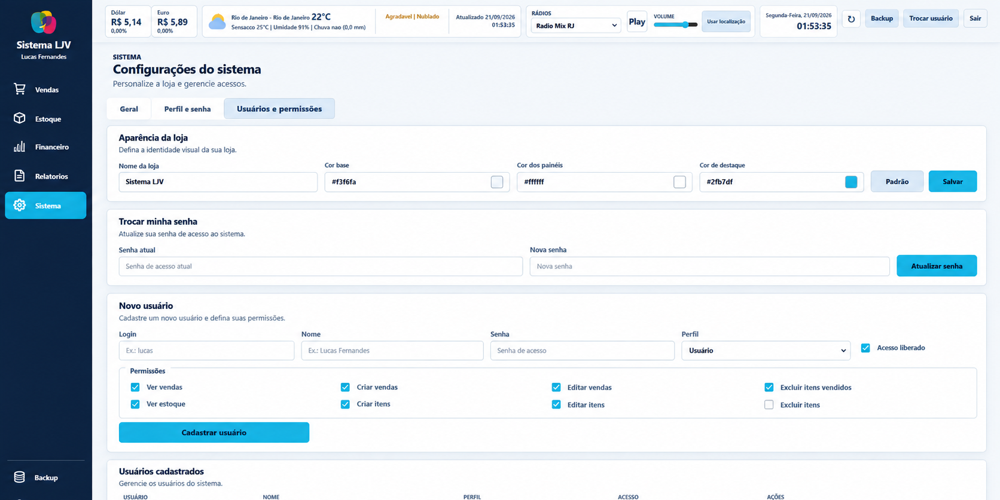

## 🕰️ Evolução visual

As imagens abaixo preservam uma versão anterior da interface e demonstram a evolução contínua do produto.

### Versão anterior — Login

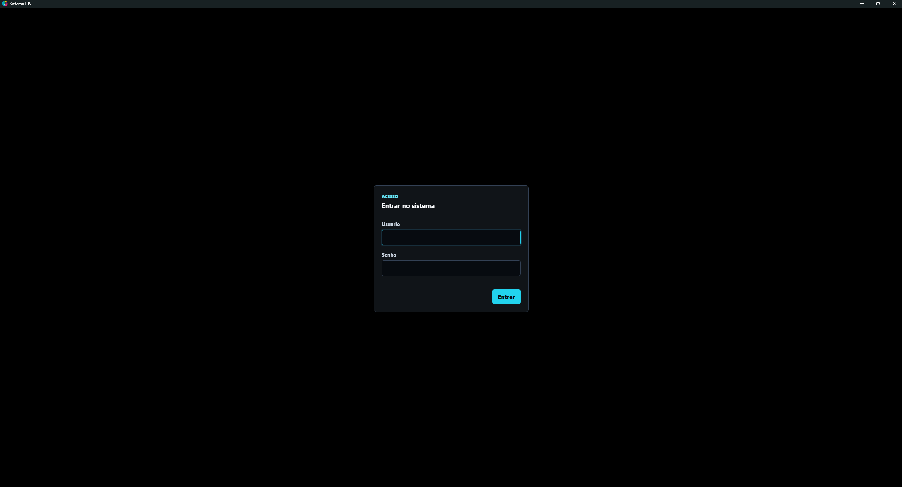

### Versão anterior — Vendas

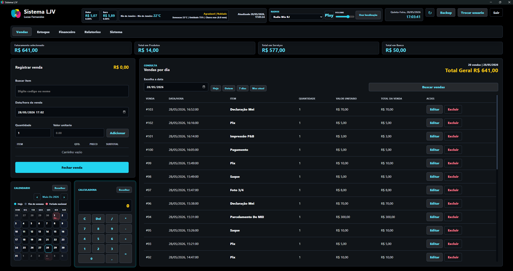

### Versão anterior — Estoque

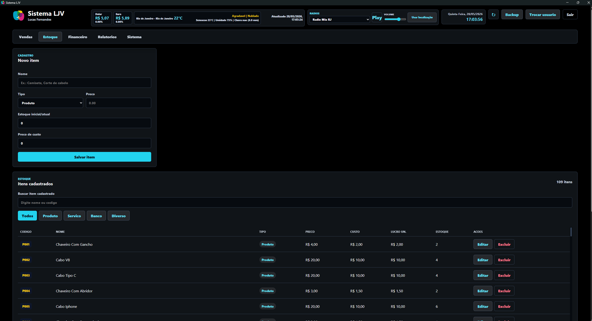

### Versão anterior — Financeiro

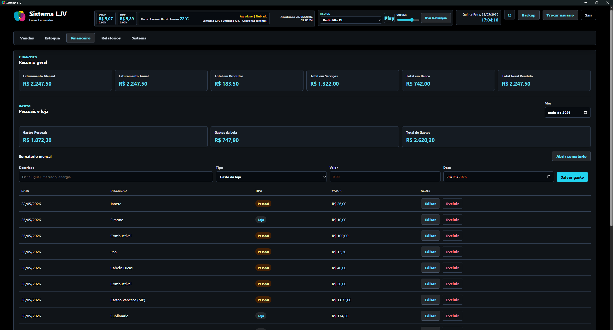

### Versão anterior — Relatórios

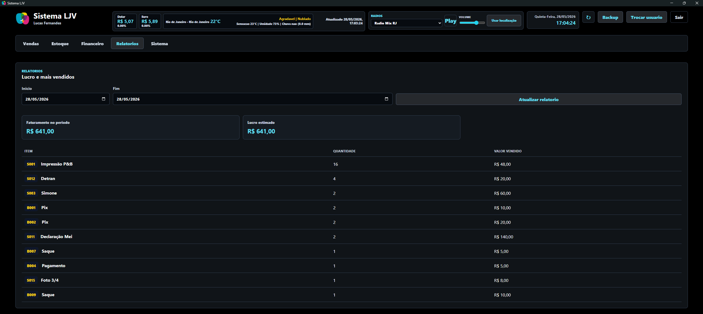

### Versão anterior — Sistema

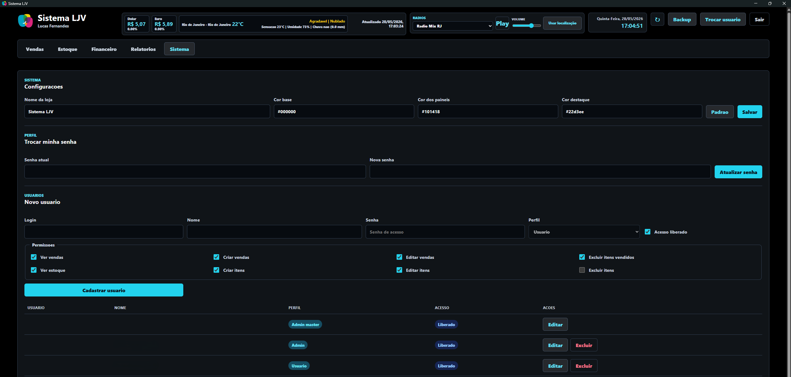

## 🧱 Decisões técnicas

- Frontend e backend integrados para simplificar a operação e a publicação.
- Camada serverless para entregar a interface e processar as regras do sistema.
- Persistência baseada em banco de dados SQLite serverless.
- Valores monetários tratados em centavos para evitar imprecisões de ponto flutuante.
- Regras de sessão, permissões, estoque e auditoria aplicadas no backend.
- Estrutura de dados versionada para facilitar a evolução do produto.

## 🔒 Segurança e privacidade

Este repositório não contém código operacional, credenciais, backups, banco de dados ou dados de clientes. As informações apresentadas servem exclusivamente para demonstrar o escopo, a arquitetura e a evolução visual do Sistema LJV.

## 📚 Documentação

- [Arquitetura](docs/arquitetura.md)
- [Funcionalidades](docs/funcionalidades.md)
- [Segurança e operação](docs/seguranca-e-operacao.md)
- [Como o sistema funciona](docs/como-funciona-o-sistema.md)
- [Estrutura pública do case study](docs/estrutura-do-projeto.md)

## ℹ️ Sobre este repositório

O objetivo deste projeto público é demonstrar a arquitetura, o escopo funcional, as decisões técnicas e a evolução visual do Sistema LJV, sem disponibilizar uma cópia operacional do produto.
